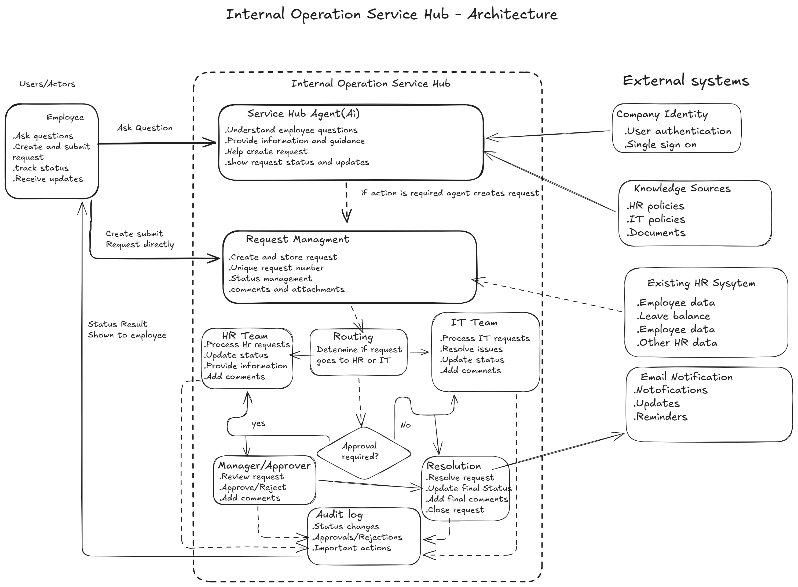

# Architecture Draft

## Internal Operations Service Hub

## 1. Purpose and Scope

The Internal Operations Service Hub provides one central place where employees can ask HR and IT questions, submit service requests, and track their progress.

The architecture supports:

- Answering common HR and IT questions.
- Creating and tracking requests.
- Routing requests to the correct team.
- Processing approvals when required.
- Showing status and results to employees.
- Protecting sensitive information.
- Recording important actions.

The current scope is an architecture draft only. It does not define application code, database implementation, APIs, deployment, or production infrastructure.

## 2. Structure and Flow

### Main Components

#### Service Hub Agent

The Service Hub Agent:

- Understands employee questions.
- Provides information from approved knowledge sources.
- Helps employees create requests when needed.
- Shows request status and updates.

Employees may also submit a request directly.

#### Request Management

Request Management:

- Creates and stores requests.
- Generates a unique request number.
- Maintains request status.
- Stores employee notes and attachments.
- Assigns requests to the responsible team or agent.

#### Routing

Routing identifies whether the request belongs to HR or IT and sends it to the correct team.

#### HR and IT Teams

The HR and IT teams process requests related to their service area, update the status, and provide a resolution.

#### Approval Handling

When a request requires approval, it is sent to an authorized manager or approver.

The approver can approve or reject the request and add a comment.

#### Resolution

When the work is completed, the responsible team adds the final resolution and updates the request status.

#### Audit Log

The Audit Log records important actions such as:

- Status changes.
- Assignment changes.
- Approvals and rejections.
- Resolution and closure.

### Main Request Flow

1. The employee asks the Service Hub Agent a question or submits a request directly.
2. The agent answers the question when approved information is available.
3. When an action is required, a request is created.
4. Request Management stores the request.
5. Routing sends the request to HR or IT.
6. The responsible team processes the request.
7. If approval is required, an authorized approver makes the decision.
8. The request is resolved or rejected.
9. The employee receives the status and result.

The request statuses are:

`Pending -> In Progress -> Resolved -> Closed`

A request can also become `Rejected`.

### External Dependencies

The Service Hub may use:

- Company Identity / SSO for authentication.
- Knowledge Sources for HR and IT policies.
- An existing HR system for employee information and leave balances.
- Email or Teams for notifications and reminders.

These systems remain outside the Service Hub boundary.

## 3. Trust and Resilience

### Authorization

- Employees can only access requests they are authorized to view.
- HR users can only process permitted HR requests.
- IT users can only process permitted IT requests.
- Only authorized approvers can approve or reject requests.
- The Service Hub Agent must follow the same access rules.
- Sensitive HR information must not be shown to unauthorized users.

### Failure Handling

- If an external HR system is unavailable, the Service Hub should report that the information is temporarily unavailable instead of displaying incorrect data.
- If routing fails, the request should remain stored as Pending for manual review.
- If a notification fails, the request and its status must still remain available in the Service Hub.
- If an approval notification fails, the request should remain waiting for the approver and must not be lost.

## 4. Architecture Decisions

### One Service Hub Agent

One Service Hub Agent is used for both HR and IT.

This gives employees one entry point while routing requests to the correct specialized team.

### Direct and Assisted Request Submission

Employees can submit a request directly or ask the Service Hub Agent for help.

Both methods use the same Request Management process.

### Separate Processing and Approval

HR and IT teams process requests, but only authorized approvers make approval decisions.

This protects sensitive and high-impact decisions.

### External Data Ownership

Official employee information and leave balances remain owned by the existing HR system.

The Service Hub retrieves this information when needed instead of creating another master copy.

### Audit Important Actions

Status changes, assignments, approvals, rejections, and resolutions are recorded to provide traceability.